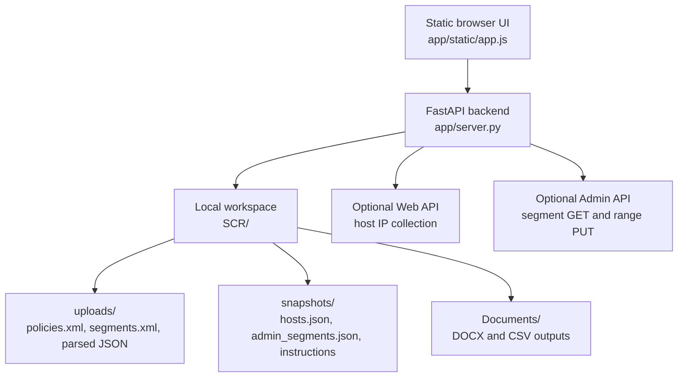
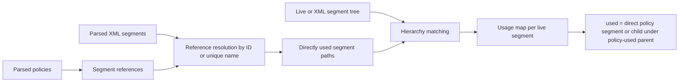
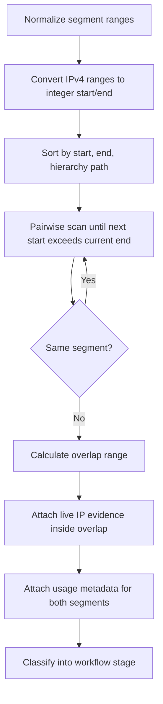
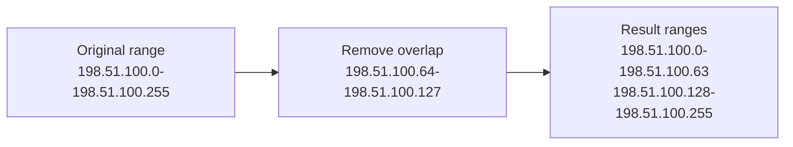
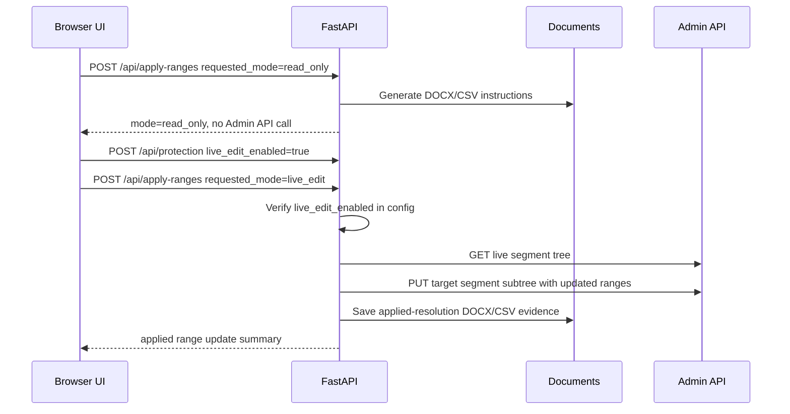
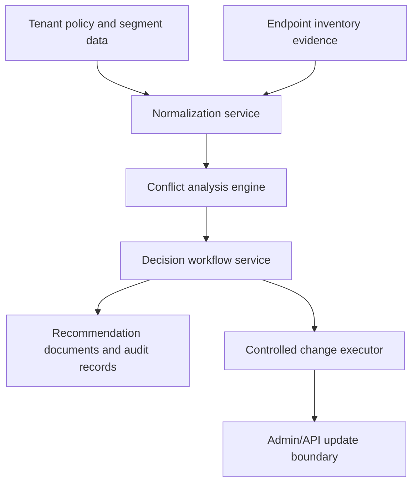

# SCRM Engineering Methods Handover

## Scope

This document describes the engineering approach behind Segment Conflict Resolution Management. It focuses on the data model, conflict algorithms, API boundaries, safety controls, document generation, and future cloud implementation considerations.

## Current Architecture

SCRM is a single-container FastAPI application with a static browser UI. It uses local filesystem storage only. There is no external database requirement.



## Runtime Folders

| Path | Purpose |
| --- | --- |
| `SCR/uploads` | Uploaded XML files and parsed summaries. |
| `SCR/snapshots` | Host IP evidence, Admin API segment snapshots, generated instruction state. |
| `SCR/Documents` | Generated DOCX and CSV deliverables. |
| `SCR/config.json` | Project name, API metadata, protection mode, and locally obfuscated credentials. |

The container runs as non-root UID `10001`. Linux bind-mounted `SCR` folders must be writable by that UID.

## Backend Entry Points

| Endpoint | Method | Purpose |
| --- | --- | --- |
| `/api/state` | GET | UI state, loaded artifacts, masked API config, protection mode, last instructions. |
| `/api/upload/{artifact_type}` | POST | Upload policies XML, segments XML, or offline host IP evidence. |
| `/api/config/{kind}` | POST | Save Web API or Admin API connection metadata. |
| `/api/test/{kind}` | POST | Test Web API or Admin API credentials without saving unnecessary state. |
| `/api/collect/hosts` | POST | Collect active host IP evidence from Web API. |
| `/api/collect/admin-segments` | POST | Collect live segment hierarchy from Admin API. |
| `/api/analysis` | GET | Build and return conflict analysis. |
| `/api/protection` | POST | Switch between read-only and live-edit mode. |
| `/api/apply-ranges` | POST | Generate instructions or apply selected range removals. |
| `/api/conflict-report` | POST | Generate report-only DOCX/CSV for conflict lists. |
| `/api/documents` | GET | List generated documents. |
| `/api/export/workspace.zip` | GET | Export portable workspace bundle, excluding passwords. |
| `/api/import/workspace` | POST | Restore workspace bundle. |

## Input Normalization

### Policies XML

Policies are parsed into:

- policy ID
- policy name
- enabled state
- folder path
- segment references from policy-level and sub-rule-level configuration

Segment references are normalized by ID first, then by unique segment name when ID is unavailable.

### Segments XML

Segments are parsed into:

- segment ID
- stable key derived from name and hierarchy path
- segment name
- hierarchy path
- description
- depth
- ranges
- child count

### Admin API segments

Live Admin API segments are normalized into the same segment row model as XML segments. If live segments are present, analysis uses the live segment tree as the active range source. If no Admin API snapshot exists, the app falls back to the uploaded Segments XML.

### Host IP evidence

Host evidence can come from:

- live Web API collection
- offline host collector JSON import

The backend only needs normalized endpoint IPs for conflict impact scoring.

## Usage Model

Segment usage is derived from policy references.



### USED definition

A segment is marked `USED` if:

- it is directly referenced by a policy or sub-rule segment assignment, or
- it is under a parent segment that is directly referenced by policy.

This inherited usage rule protects children beneath a policy-used parent from being treated as safe cleanup targets.

### NOT USED definition

A segment is `NOT USED` when:

- no policy directly references it, and
- it is not under a policy-used parent.

## Conflict Detection Algorithm

The backend converts every segment range into integer IP start/end values, sorts them, then scans for pairwise overlaps.



The app de-duplicates conflict records by sorted segment keys plus overlap range.

## Stage Classification

| Stage | Condition | Default action |
| --- | --- | --- |
| Policy Usage Wins | One segment is USED and the other is NOT USED | Remove the overlap from the NOT USED segment. |
| Ownership Decisions | Both segments are NOT USED | Select owner; remove overlap from duplicate side, or keep as-is. |
| Admin or Policy Owner Decision | Both segments are USED and live IPs exist in the overlap | No automatic cleanup; admin selects owner or keeps as-is. |
| Lower Priority Review | Both segments are USED and no live IP evidence exists | Optional owner selection or report-only documentation. |
| Zero-Range Segment Report | Segment has no remaining ranges | Report only; no automatic deletion. |

## Range Subtraction Method

Live or manual cleanup does not delete segments. It calculates a new range list for the target segment:

```text
original ranges - selected overlapping ranges = resulting ranges
```

If a selected removal splits a larger range, the algorithm preserves the non-overlapping fragments.



## Live Edit Boundary

The backend enforces the live-edit boundary regardless of frontend state.



Read-only requests must never call Admin API mutation paths.

## Admin API Update Method

The current implementation updates only the target segment subtree:

1. Fetch current Admin API segment tree.
2. Locate the target segment by stable key, path, and name.
3. Determine whether the live API uses `ranges` or `Ranges`.
4. Subtract selected overlap ranges from the target range list.
5. PUT the updated target subtree with force changes.
6. Refresh the local Admin API segment snapshot.
7. Recalculate conflicts.

The app does not create, move, rename, or delete segments.

## Report And Evidence Generation

The app generates two kinds of evidence:

### Action reports

Action reports contain selected range removals:

- project name
- stage
- segment name and path
- source range
- overlap to remove
- resulting ranges
- reason
- manual instruction text
- optional visualization PNGs captured from the UI

### Conflict inventory reports

Conflict inventory reports document conflicts even when no cleanup action is selected:

- project name
- stage
- overlap range
- IP count
- live host count
- live IP samples
- left and right segment details
- policy usage counts
- decision: keep as-is / no range update selected

## Visualization Lenses

The UI exposes multiple graph lenses:

| Lens | Purpose |
| --- | --- |
| Main segment-policy mapping | Global hierarchy view linking segments to policies. |
| Range investigation | One overlap range mapped to attached segments and evidence. |
| Segment investigation | One segment mapped to ranges, conflicts, and policies. |
| Live IP investigation | One live IP mapped to matching ranges and segments. |
| Conflict policies | Conflict ranges, attached segments, and policy references in one view. |

These lenses are designed to avoid one unreadable mega-graph. Users can focus on one range, one segment, one endpoint IP, or one policy relationship at a time.

## Frontend State Concepts

The frontend stores UI-only focus state in memory and local storage:

- active page
- active workflow stage
- visualization lens
- visualization filters
- collapsed or expanded graph sections
- selected conflict decisions
- hidden policy/segment links for focus

Analysis truth remains backend-derived from current artifacts and snapshots.

## Cloud Implementation Notes

If SCRM becomes a cloud service, the recommended design is to preserve the current separation of concerns:



### Services to separate

- artifact ingestion and validation
- segment/policy normalization
- conflict detection engine
- decision workflow and approval state
- live change executor
- document/evidence generation
- audit trail and history

### Cloud safety additions

- role-based access control for live edits
- approval workflow for Stage 3 conflicts
- immutable audit log of generated instructions and applied changes
- tenant-scoped rate limiting for Admin API calls
- dry-run preview of resulting ranges
- rollback package generation from pre-change snapshots

## Testing Strategy

### Unit-level tests

- XML parser coverage for policy folder nesting and segment references.
- Segment XML parser coverage for IDs, hierarchy, descriptions, and ranges.
- Admin API normalization coverage for lower-case and upper-case field names.
- IPv4 range parsing and sorting.
- Range subtraction, including split-range behavior.
- Stage classification matrix.

### Integration tests

- Offline mode with only XML artifacts.
- Offline host IP import.
- Web API host IP collection.
- Admin API segment collection.
- Read-only apply request generates DOCX/CSV and does not call Admin API PUT.
- Live-edit apply request updates only target segment subtree.
- Workspace export excludes passwords and restores project state.

### UI tests

- Artifact load and clear.
- Read-only/live-edit protection toggle.
- Workflow stage navigation.
- Decision selection.
- Documents download/delete.
- Visualization filtering and PNG export.

## Known Constraints

- Credentials are locally obfuscated, not strongly encrypted.
- Host evidence currently focuses on IP matching, not full endpoint context.
- The Admin API mutation boundary supports range updates only.
- Segment deletion remains a manual administrative action.
- IPv4 is the primary implemented conflict model.

## Extension Backlog

- Add richer endpoint attributes for impact scoring.
- Add customer-defined ownership rules for Stage 2.
- Add policy owner metadata and approval routing.
- Add rollback package generation for live edits.
- Add scheduled conflict drift detection.
- Add historical trend reporting per project.
- Add API-native evidence export for cloud analytics.
