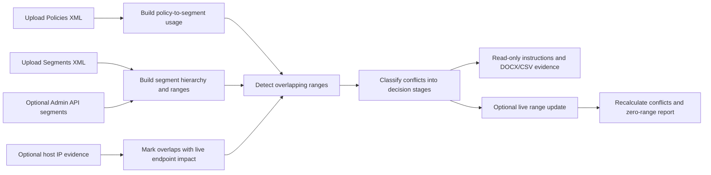
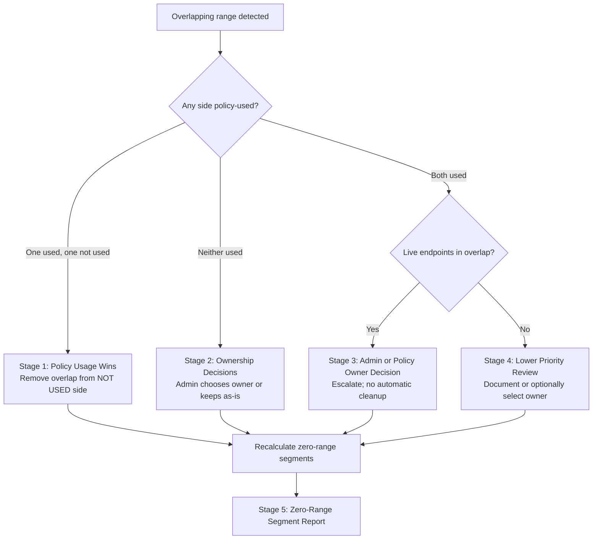

# SCRM Product Outcomes Handover

## Executive Summary

Segment Conflict Resolution Management, or SCRM, is a portable workflow app for finding and resolving overlapping network segment ranges without losing policy intent. It combines policy configuration, segment hierarchy, optional live host evidence, and optional live segment data to turn a messy range-overlap problem into controlled decisions.

The core product outcome is simple: help teams remove duplicate or conflicting segment ranges while preserving the segment IDs and hierarchy that policies already depend on.

## Audience

- Product management evaluating whether the workflow should become a cloud feature.
- Engineering teams implementing or extending the analysis engine.
- Professional services and operations teams cleaning customer segment inventories.
- Security architects validating whether segment cleanup will break policy scope.

## Customer Problems Solved

### 1. Segment overlap creates unclear policy ownership

When multiple segments contain the same IP range, administrators cannot reliably tell which segment should own an endpoint. That ambiguity affects policy matching, reporting, operational ownership, and cleanup confidence.

SCRM shows the exact overlapping range, the attached segments, and whether each segment is used by policies.

### 2. Used and unused segments are treated differently

Removing a range from a segment used by policy can change enforcement scope. Removing a duplicate range from an unused segment is usually safer.

SCRM prioritizes policy-used segments and moves risky decisions into an explicit review stage.

### 3. Live endpoints change the risk profile

An overlap with no live host evidence is lower urgency. An overlap containing live hosts may affect active endpoints and should be reviewed more carefully.

SCRM uses live or imported host IP evidence to separate high-impact conflicts from lower-priority cleanup.

### 4. Manual cleanup is hard to audit

Segment cleanup often happens through tribal knowledge and screenshots. SCRM creates downloadable DOCX and CSV outputs that explain the decision, affected ranges, affected segments, and recommended action.

### 5. Live editing must be controlled

Teams may want analysis without any changes, or they may want controlled range updates. SCRM starts in read-only mode and requires explicit live editing before it can update ranges through the Admin API.

## Operating Modes

| Mode | Inputs | Outcome |
| --- | --- | --- |
| Offline analysis | Policies XML, Segments XML | Detect configuration-based range overlaps and policy usage impact. |
| Offline with host evidence | Policies XML, Segments XML, host IP JSON | Detect overlaps and prioritize conflicts that contain endpoint IPs. |
| Live host evidence | Policies XML, Segments XML, Web API host IP collection | Use current endpoint IPs without importing a separate file. |
| Controlled live cleanup | Policies XML, Segments XML, Web API, Admin API | Apply selected range removals after live editing is explicitly enabled. |

## High-Level Workflow

## Decision Stages

### 1. Policy Usage Wins

Policy-used segments are treated as authoritative over not-used segments. If a not-used segment overlaps with a policy-used segment, SCRM recommends removing the overlap from the not-used segment.

Customer value: quick cleanup of low-risk duplicates without breaking configured policy intent.

### 2. Ownership Decisions

Two not-used segments overlap. SCRM can suggest an owner based on hierarchy and naming, but the administrator may choose either segment or keep the overlap as-is.

Customer value: reduces stale configuration while preserving administrative control.

### 3. Admin or Policy Owner Decision

Two policy-used segments overlap and the overlap contains live hosts. SCRM does not auto-fix this case because both sides have policy impact and active endpoint evidence.

Customer value: prevents accidental enforcement changes and makes the required ownership decision explicit.

### 4. Lower Priority Review

Two policy-used segments overlap but there is no live endpoint evidence in the overlap. SCRM supports documenting the conflict list even when no change is selected.

Customer value: allows backlog cleanup planning without forcing immediate changes.

### 5. Zero-Range Segment Report

After cleanup, some segments may have no ranges left. SCRM reports them for manual review instead of deleting them automatically.

Customer value: avoids unsafe deletion while giving administrators a clear hygiene list.

## Decision Model

## Safety Principles

- Read-only is the default mode.
- Read-only actions generate instructions and evidence only.
- Live editing must be explicitly enabled by the user.
- The app updates ranges only.
- The app does not create, rename, move, or delete segments.
- The app preserves segment hierarchy and policy-used segment IDs.
- Generated workspace bundles exclude passwords.

## Current User Experience

### Workflow Page

- Loads artifacts and API evidence.
- Shows workspace KPIs.
- Provides read-only versus live-edit protection.
- Presents the five conflict stages.
- Generates instructions or applies selected range removals depending on protection mode.

### Conflict Investigation Page

- Provides multiple visual lenses:
  - range-focused investigation
  - segment-focused investigation
  - live IP-focused investigation
  - policies and segment relationship investigation
  - full segment-policy mapping tree
- Enables filter and focus workflows so users do not need to inspect all conflicts at once.
- Supports PNG export for graph evidence.

### Documents Page

- Lists generated DOCX and CSV outputs.
- Allows download and deletion.
- Keeps generated evidence tied to the project/workspace name.

## Evidence Outputs

| Output | Purpose |
| --- | --- |
| DOCX recommendation document | Human-readable explanation of conflict decisions and selected resolutions. |
| CSV instructions | Admin-executable range cleanup list. |
| Zero-range CSV | Manual review list for empty segments after cleanup. |
| Workspace ZIP | Portable bundle of loaded artifacts, snapshots, and generated documents, excluding passwords. |
| PNG diagrams | Visual evidence for selected conflict views. |

## Cloud Feature Opportunities

SCRM can become a cloud-native capability by moving from local files to managed tenant data and controlled change workflows.

### Suggested cloud capabilities

- Continuous segment overlap detection after every segment or policy change.
- Conflict severity scoring based on policy usage and live host impact.
- Approval workflow for Stage 3 conflicts.
- Change simulation before applying range updates.
- Audit trail of who approved each range cleanup.
- Drift detection between uploaded/offline configuration and live segment state.
- Scheduled hygiene reports for unused, duplicate, and zero-range segments.
- Integration with ticketing systems for manual cleanup tasks.

## Product Metrics To Track

- Number of overlapping ranges detected.
- Number of policy-used versus not-used conflicts.
- Number of live endpoints inside overlaps.
- Number of conflicts resolved without changing policy-used segments.
- Number of Stage 3 escalations requiring owner approval.
- Number of zero-range segments created after cleanup.
- Time saved compared with manual segment review.

## Recommended Product Positioning

SCRM is not just an overlap detector. It is a controlled range ownership workflow.

The most important customer message is:

> Remove duplicate ranges from low-risk segments, preserve policy-used segment intent, and escalate only the conflicts that can affect live endpoint ownership.

## Open Product Questions

- Should live editing require a second approval step in cloud?
- Should policy-used parent segments always make all children used, or should this be configurable?
- Should Stage 2 ownership rules be customer-defined through labels, naming patterns, or hierarchy preference?
- Should zero-range segments be auto-suppressed, manually deleted, or converted into cleanup recommendations only?
- Should host evidence include only IPs, or richer endpoint context in future versions?

